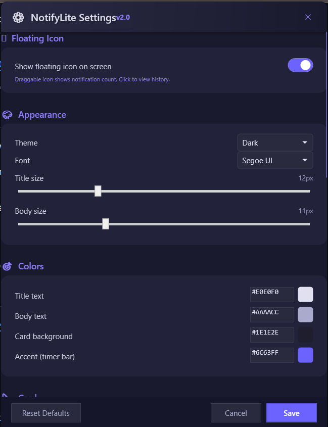

<p align="center">
  <h1 align="center">🔔 NotifyLite</h1>
</p>

<p align="center">
  <a href="https://github.com/AfaqAhmad0/NotifyLite/releases/latest"></a>
  <a href="https://github.com/AfaqAhmad0/NotifyLite/blob/main/LICENSE"></a>
  
  
  <a href="https://github.com/AfaqAhmad0/NotifyLite"></a>
</p>

<h2 align="center">Open Source Windows Notification Replacement</h2>

<p align="center"><strong>Replace boring default Windows notifications with beautiful customizable toast alerts, notification history, and app-level controls.</strong></p>

<p align="center">
  <a href="#-quick-start"><b>🚀 Install</b></a> •
  <a href="docs/index.md"><b>📚 Documentation</b></a> •
  <a href="#-demo"><b>👀 Demo</b></a> •
  <a href="CONTRIBUTING.md"><b>🤝 Contribute</b></a>
</p>

---

## 🚀 Quick Start
Get your custom toast notifications for Windows running in under 2 minutes:

1. Download the latest `NotifyLite.zip` from [Releases](https://github.com/AfaqAhmad0/NotifyLite/releases).
2. Extract the ZIP file.
3. Double-click `Install.bat` and click **Run anyway** if prompted.
4. Launch **NotifyLite** from your Start Menu.
5. *First run only:* Go to **Settings > Privacy > Notifications** and allow NotifyLite access.

---

## 🎥 Demo
*(Demo video link placeholder: [Watch NotifyLite in Action](https://youtube.com/placeholder))*


## 📸 Screenshots
<p align="center">
  
  
</p>

---

## ❓ Why Use NotifyLite?
The default Windows notification center alternative is rigid and distracting. NotifyLite gives you back control. It silently intercepts your system alerts and redraws them exactly how you want. Whether you're a developer dealing with build alerts, a productivity enthusiast who needs focus, or just someone who loves customizing their desktop, NotifyLite is your ultimate Windows notification manager.

### 💼 Use Cases
- **Productivity & Focus:** Mute distracting apps and customize auto-dismiss times so alerts vanish exactly when you want them to.
- **Developers:** Assign different `.wav` sounds to your IDE vs. your Slack app. Know what's happening without taking your eyes off the code.
- **Desktop Customizers:** Perfectly match your desktop's aesthetic (Rainmeter, custom themes) down to the exact hex codes and corner radius.

---

## ⚖️ NotifyLite vs Default Windows Notifications

| Feature | NotifyLite | Default Windows |
|---------|-----------|----------------|
| **Visual Customization** | Full (Colors, fonts, sizes, opacity) | None (Locked to OS theme) |
| **Notification History** | Yes (Floating badge & popup widget) | Action Center (Cluttered) |
| **App Controls** | Per-app muting | Basic OS toggles |
| **Custom Sounds** | Custom `.wav` per app | System defaults only |
| **Positioning** | All 4 corners, Custom X/Y, Stick-to-Icon | Locked to Bottom Right |
| **Open Source** | Yes (MIT) | Closed Source |
| **Task Switcher** | Hidden from Alt+Tab | Visible / Integrated |

---

## ✨ Features
- 🎨 **Custom toast cards** - dark/light themed, animated slide-in/out notifications
- 🫧 **Floating Icon & History Widget** - Optional draggable badge showing unread notifications, clicking it reveals a scrollable history!
- 👆 **Click to open** - click any toast to jump to the source app
- ✕ **Quick dismiss** - close button to dismiss without opening; notifications gracefully shrink into the floating widget
- 🔊 **Notification sounds** - system default or custom `.wav` per app
- 📋 **Action Center** - notifications still persist in Windows notification tray (Win+N)
- ⚙️ **Fully customizable** - Settings UI accessible from tray icon, featuring a modern custom transparent UI
- 🖥️ **Tray-only app** - runs silently in system tray, completely hidden from Alt+Tab/Win+Tab task switcher

---

## 🎛️ Customization
All settings accessible via **right-click tray icon → ⚙️ Settings**:

| Category | Options |
|----------|---------|
| **Floating Icon** | Toggle the draggable floating badge (shows unread count & history) |
| **Appearance** | Theme (Dark/Light), font family, title & body sizes |
| **Colors** | Title text, body text, card background, accent color - all via hex picker |
| **Card** | Width, corner radius, card opacity, text opacity |
| **Behavior** | Auto-dismiss duration, max visible toasts, position (**all 4 corners, stick to icon, + custom X/Y coordinates**) |
| **Sound** | Enable/disable, system default or custom `.wav`, per-app overrides (mute specific apps) |

---

## 📦 Installation (Detailed)

### Manual Install (PowerShell as Admin)
```powershell
cd Package
certutil -addstore TrustedPeople .\NotifyLite.cer
Add-AppxPackage .\NotifyLite.msix
```

## 🔨 Build from Source
### Requirements
- [.NET 8 SDK](https://dotnet.microsoft.com/download/dotnet/8.0)
- [Windows SDK](https://developer.microsoft.com/windows/downloads/windows-sdk/) (for `MakeAppx.exe` and `SignTool.exe`)

### Build & Install
```powershell
cd NotifyLite
powershell -ExecutionPolicy Bypass -File Scripts\build-msix.ps1
```

## 🗺️ Roadmap
We are constantly improving NotifyLite. Here's what's planned:
- **Filtering Rules:** Regex-based muting of specific notification text.
- **Live Preview:** See your custom toast changes instantly in the Settings window.
- **Microsoft Store Listing:** To remove the need for manual certificate trusting.
- **Plugin System:** Allow community scripts to trigger on specific notifications.

## 💬 FAQ
**Can I customize Windows notifications?**
Yes! NotifyLite acts as a complete Windows notification replacement. It intercepts alerts and draws them using your own styling.

**Does this support Windows 11?**
Yes, NotifyLite provides Windows 11 notification customization and is fully backwards compatible with Windows 10 (64-bit).

**How do I completely uninstall it?**
Run the included `Uninstall.ps1` script to remove the package and restore the default `ToastEnabled` registry key.

*(For more FAQs, visit our [Documentation](docs/faq.md))*

## 📄 License
MIT License - free to use, modify, and distribute.
